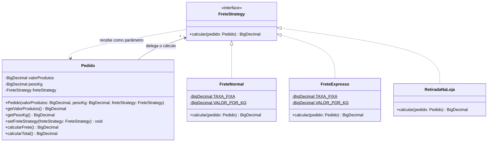

```mermaid
classDiagram
    class FreteStrategy {
        <<interface>>
        +calcular(pedido: Pedido) BigDecimal
    }

    class Pedido {
        -BigDecimal valorProdutos
        -BigDecimal pesoKg
        -FreteStrategy freteStrategy
        +Pedido(valorProdutos: BigDecimal, pesoKg: BigDecimal, freteStrategy: FreteStrategy)
        +getValorProdutos() BigDecimal
        +getPesoKg() BigDecimal
        +setFreteStrategy(freteStrategy: FreteStrategy) void
        +calcularFrete() BigDecimal
        +calcularTotal() BigDecimal
    }

    class FreteNormal {
        -BigDecimal TAXA_FIXA$
        -BigDecimal VALOR_POR_KG$
        +calcular(pedido: Pedido) BigDecimal
    }

    class FreteExpresso {
        -BigDecimal TAXA_FIXA$
        -BigDecimal VALOR_POR_KG$
        +calcular(pedido: Pedido) BigDecimal
    }

    class RetiradaNaLoja {
        +calcular(pedido: Pedido) BigDecimal
    }

    Pedido --> "1" FreteStrategy : delega o cálculo
    FreteStrategy ..> Pedido : recebe como parâmetro
    FreteStrategy <|.. FreteNormal
    FreteStrategy <|.. FreteExpresso
    FreteStrategy <|.. RetiradaNaLoja
```
